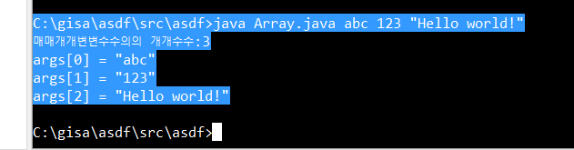
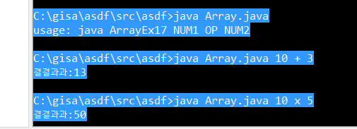

# CH05 배열
1. 배열: **같은 타입**의 여러 변수를 하나의 묶음으로 다루기 위한 구조
* 모든 배열이 동적으로 할당(dynamically allocated)
* 배열은 자바에서 객체 - length 등 사용 가능
* 데이터 타입 뒤에 []를 사용해 다른 변수와 같이 선언 가능
* 배열의 변수는 index가 0부터 생성
* 배열을 static field, local 변수, 메서드 매개변수로 사용가능
* 배열의 크기는 int나 short 값으로 지정해야 하며, long은 사용하지 않음
* 배열 타입의 슈퍼 클래스는 Object
* 모든 배열 타입은 Cloneable, java.io.Serializable 인터페이스를 구현함


2. 배열 선언
* 단지 선언은 참조변수를 위한 공간이 만들어지고, 배열을 new 연산자와 함께 생성해야 값을 저장하는 공간이 생김
* 길이가 0인 배열도 생성이 가능하다.
```java
int[] score;
score = new int[5];
타입[] 배열이름 = new 타입[길이];
```

3. 배열 길이와 인덱스
```java
int[] score = new int[5]; // 길이가 5인 int배열
score[3] = 100; // 배열의 4번째 요소에 100을 저장
int value = score[3]; // 배열의 4번째 요소에 저장된 값을 읽어 value에 저장
```
* index로 상수 대신 변수나 수식도 사용할 수 있어 for문으로 변수 i를 인덱스로 사용해 값 할당 가능
```java
for (int i=0; i < 5; i++){
	score[i] = i * 10;
}

// int temp = score[i+1];
```
* 주의할 점은 index 범위를 벗어나는 실수는 컴파일러가 걸러주지 못하고 실행 시 에러(ArrayIndexOutOfBoundsException)가 발생한다.

4. 배열이름.length
* JVM이 배열의 길이를 별도로 관리
* 배열은 한 번 생성하면 길이를 변경할 수 없으므로 length를 이용해 접근만 가능하고 변경불가
* for문에서 배열의 길이를 직접 적는 것보다 length를 이용하는게 조건식 변경할 필요가 없어 효율적
```java
for (int i=0; i < score.length; i++){
	score[i] = i * 10;
}
```

5. 배열의 길이 변경하기
* 한 번 생성되면 길이 변경할 수 없다
    * 더 큰 배열을 새로 생성해 기존 배열의 내용을 복사하기

6. 초기화
```java
int[] score = new int[5];

// 1번
score[0] = 50; 

// 2번
for (int i=0; i < score.length; i++){
	score[i] = i * 10;
} 

// 3번, 길이를 적지 않아도 됨
int[] score = new int[]{ 50, 60, 70, 80, 90};
int[] score = { 50, 60, 70, 80, 90}; // new 생략 가능(단, 생성과 초기화를 같이 할 때만)
```

7. 배열 출력
    1. for문 사용
    2. Arrays.toString(배열이름) 메서드 사용 - 배열을 문자열로 만들어 return
```java
int[] iArr = { 50, 60, 70, 80, 90 };
System.out.println(Arrays.toString(iArr)); // [50, 60, 70, 80, 90 ]
System.out.println(iArr); // 타입@주소 형식으로 출력, [I@b4c966a(16진수)

char[] chArr = { 'a', 'b', 'c', 'd' };
System.out.println(chArr); // abcd
```

8. 배열 복사
* for문 사용 - 기존 길이의 2배로 배열 생성
```java
int[] score = new int[]{ 50, 60, 70, 80, 90};
int[] tmp = new int[score.length*2];

for (int i=0; i < score.length; i++){
	tmp[i] = score[i];
} 

score = tmp; // 참조변수 score가 tmp를 가리켜 기존 배열은 사용하지 않게 됨(GC) 
System.out.println(Arrays.toString(tmp)); // [50, 60, 70, 80, 90, 0, 0, 0, 0, 0]
```

* System.arraycopy()를 이용한 배열 복사
    * 지정된 범위의 값들을 한 번에 통째로 복사(배열이 연속적으로 저장되어 있다는 특징)
    * for문보다 추천

```java
System.arraycopy(num, 0, newNum, 0, num.length);
// num[0]에서 newNum[0]으로 num.length개의 데이터 복사

char[] abc = { 'A', 'B', 'C', 'D' };
char[] num = { '0', '1', '2', '3', '4', '5', '6', '7', '8', '9' };
System.arraycopy(abc, 0, num, 0, abc.length);
System.out.println(num); // ABCD456789
```

9. 배열의 활용

* 총합과 평균
```java
		int sum = 0;
		float average = 0f;

		int[] score = { 100, 88, 100, 100, 90 };

		for (int i = 0; i < score.length; i++) {
			sum += score[i];
		}
		average = sum / (float) score.length; // int끼리 연산은 loss 발생

		System.out.println("총점: " + sum);
		System.out.println("평균: " + average);

// 총점: 478
// 평균: 95.6
```

* 최대값과 최소값
```java
int[] score = { 79, 88, 91, 33, 100, 55, 95 };

int max = score[0];
int min = score[0];

for (int i = 1; i < score.length; i++) {
	if (score[i] > max) {
		max = score[i];
	} else if (score[i] < min) {
		min = score[i];
	}
}

System.out.println("최대값: " + max);
System.out.println("최소값: " + min);

// 최대값: 100
// 최소값: 33
```

* 섞기
```java
int[] numArr = new int[10];
		for ( int i=0; i < numArr.length; i++) {
			numArr[i] = i;
			
		}
		
		System.out.println();
		
		for (int i=0; i < numArr.length; i++) {
			int n = (int) (Math.random() * 10);
			int tmp = numArr[0];
			numArr[0] = numArr[n];
			numArr[n] = tmp;
			
		}
		System.out.println(Arrays.toString(numArr));
}
// numArr[0] 과 numArr[n]의 값을 바꾸는 반복을 돌려 원 배열의 값을 섞음
```
```java
int[] ball = new int[45];
		for ( int i=0; i < ball.length; i++) {
			ball[i] = i + 1;
			
		}
	
		for ( int i=0; i < 6; i++) {
			int tmp = ball[0];
			int j = (int) (Math.random() * 45);
			tmp = ball[i];
			ball[i] = ball[j];
			ball[j] = tmp;
			
		}
		
		for ( int i =0; i < 6; i++) {
			System.out.printf("ball[%d]=%d%n", i, ball[i]);
		}

```

* 임의의 값으로 배열 채우기
```java
int[] code = { -4, -1, 3, 6, 11 };
		int[] arr = new int[10];

		for (int i = 0; i < arr.length; i++) {
			int tmp = (int) (Math.random() * code.length);
			arr[i] = code[tmp];
		}
		System.out.println(Arrays.toString(arr));

```

* 정렬하기
```java
int[] arr = new int[10];

		for (int i = 0; i < arr.length; i++) {
			arr[i] = (int) (Math.random() * 10);
		}
		System.out.println(Arrays.toString(arr));

		for (int i = 0; i < arr.length - 1; i++) {
			boolean changed = false;
			for (int j = 0; j < arr.length - 1 - i; j++) {
				if (arr[j] > arr[j + 1]) {
					int tmp = arr[j];
					arr[j] = arr[j + 1];
					arr[j + 1] = tmp;
					changed = true;
				}
			}
			if (!changed)
				break;
		}
		System.out.println(Arrays.toString(arr));

```


* 빈도수 구하기
```java
int[] numArr = new int[10];
		int[] counter = new int[10];

		for (int i = 0; i < numArr.length; i++) {
			numArr[i] = (int) (Math.random() * 10);
		}
		
		for (int i = 0; i < numArr.length; i++) {
			counter[numArr[i]]++; // numArr[0] 0의 숫자가 8이라면 counter[8] 에 1이 증가
		}
		
		for (int i = 0; i < numArr.length; i++) {
			System.out.println(i + "의 개수: " + counter[i] );
		}
```


10. String 배열
```java
String[] name = new String[3]; // 3개의 문자열을 담을 수 있는 배열 생성
name[0] = "KIM";
String[] n = new String[] {"KIM", "PARK", "YI"};
String[] n = {"KIM", "PARK", "YI"}; // 생략 가능
```
* null로 초기화
* 참조형 배열로 객체의 주소가 저장 - 객체 배열


```java
String[] names = { "Kim", "Park", "Yi" };

		for (int i = 0; i < names.length; i++) {
			System.out.println("names[" + i + "]:" + names[i]);
		}

		names[0] = "Yu";

 // 향상된 for문
		for (String str : names) {
			System.out.println(str);
		}
```

```java
char[] hex = { 'C', 'A', 'F', 'E' };

		String[] binary = { "0000", "0001", "0010", "0011", "0100", "0101", "0110", "0111", "1000", "1001", "1010",
				"1011", "1100", "1100", "1101", "1110", "1111" };

		String result = "";

		for (int i = 0; i < hex.length; i++) {
			if (hex[i] >= '0' && hex[i] <= '9') {
				result += binary[hex[i] - '0'];
			} else {
				result += binary[hex[i] - 'A' + 10];
			}
		}

		System.out.println("hex:" + new String(hex)); // hex:CAFE
		System.out.println("binary:" + result); // binary:1100101011101101
```


11. char배열과 String 클래스
* String 클래스는 char 배열에 메서드가 추가된 것
    * 중요한 차이는 String 객체는 읽을 수만 있고 수정할 수 없음
    * 수정되는 것 같지만 사실은 새로운 문자열이 생성됨

12. String 클래스의 주요 메서드
* char charAt(int index) - 해당 index에 있는 문자를 반환
* int length() - 문자열 길이 반환
* String substring(int from, int to) - 해당 범위에 있는 문자열 반환(to 포함안함)
* boolean equals(Object obj) - 문자열의 내용이 obj와 같은지 확인한다. 같으면 true, 다르면 false
* char[] toCharArray() - 문자열을 문자배열(char[])로 변환해 반환


13. char배열과 String 클래스의 변환
```java
char[] chArr = { 'A', 'B', 'C' };
String str = new String(chArr); // char배열 -> String
char[] tmp = str.toCharArray(); // String -> char배열
```
```java
String src = "ABCDE";

		for (int i = 0; i < src.length(); i++) {
			char ch = src.charAt(i);
			System.out.println("src.charAt(" + i + "): " + ch);
		}

		char[] chArr = src.toCharArray();

		System.out.println(chArr);

// src.charAt(0): A
// src.charAt(1): B
// src.charAt(2): C
// src.charAt(3): D
// src.charAt(4): E
// ABCDE
```
```java
String source = "SOSHELP";
		String[] morse = { ".-", "-...", "-.-.", "-..", ".", "..-.", "--.", "....", "..", ".---", "-.-", ".-..", "--",
				"-.", "---", ".--.", "--.-", ".-.", "...", "-", "..-", "...-", ".--", "-..-", "-.--", "--.." }; 
		
		String result = "";

		for (int i = 0; i < source.length(); i++) {
			result += morse[source.charAt(i) - 'A'];
		}
		System.out.println("source:" + source);
		System.out.println("morse:" + result);
// source:SOSHELP
// morse:...---.........-...--.
```


14. 커맨드라인을 통해 입력 받기
```java
public class Array {
	public static void main(String[] args) {
		System.out.println("매개변수의 개수:"+args.length);
        for(int i=0;i<args.length;i++) {
            System.out.println("args["+i+"] = \""+ args[i] + "\"");
        }

	}
}
```


* 공백으로 구분해 여러 개의 문자열 전달
* 매개변수를 입력하지 않으면 크기가 0인 배열이 생성되어 args, length가 0인 배열이 됨
* 매개변수 없다고 배열이 생성되지 않으면 args의 값이 null이 될 거고 그럼 에러가 발생하겠지만, JVM이 입력된 매개변수가 없을 때, null 대신 크기가 0인 배열을 생성해 args에 전달함(고로 에러 안남)


```java
if (args.length != 3) {
			System.out.println("usage: java ArrayEx17 NUM1 OP NUM2");
			System.exit(0);
		}
		int num1 = Integer.parseInt(args[0]); 
		char op = args[1].charAt(0); // 문자열 중 operator를 문자로 변환.
		int num2 = Integer.parseInt(args[2]);

		int result = 0;

		switch (op) {
		case '+':
			result = num1 + num2;
			break;
		case '-':
			result = num1 - num2;
			break;
		case 'x':
			result = num1 * num2;
			break;
		case '/':
			result = num1 / num2;
			break;
		default:
			System.out.println("지원되지 않는 연산입니다.");
		}
		System.out.println("결과:" + result);
```



