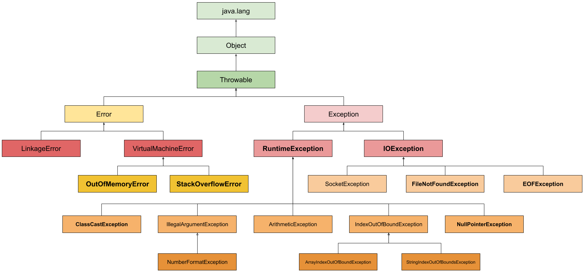

## 1. 예외처리(exception handling)

### 1.1 프로그램 오류

컴파일 에러와 런타임 에러

Compile Error :  컴파일 시 발생하는 에러

Runtime Error : 실행 시에 발생하는 에러

Logical Error : 실행은 되지만, 의도와 다르게 동작하는 것

코드를 컴파일하면 컴파일러가 *.java에 대해 오타나 잘못된 구문, 자료형 체크 등의 기본적인 검사를 수행해 오류가 있는지를 알려준다. 컴파일러가 알려 준 에러를 모두 수정해서 컴파일을 성공적으로 마치면 클래스 파일이 생성되고 생성된 클래스 파일을 실행할 수 있게 된다.

런타임 에러를 방지하기 위해 프로그램의 실행도중 발생할 수 있는 모든 경우의 수를 고려해 이에 대비하는 게 필요하다. error와 exception이 있다.

error : 프로그램 코드에 의해 수습될 수 없는 심각한 오류

exception : 프로그램 코드에 의해 수숩될 수 있는 다소 미약한 오류

### 1.2 예외 클래스의 계층구조


       
Exception의 두 그룹

- Exception 클래스와 그 자손들
- RuntimeException 클래스와 그 자손들

RuntimeException은 주로 프로그래머의 실수에 의해 발생될 수 있는 예외들로,

ArrayIndexOutOfBounds, NullPointerException, ClassCastException, ArithmeticException(정수를 0으로 나누려고 하는 경우) 등이 있다.

### 1.3 예외처리하기 - try - catch문

예외처리(exception handling)

정의 - 프로그램 실행 시 발생할 수 있는 예외에 대비한 코드를 작성

목적 - 프로그램의 비정상 종료를 막고, 정상적인 실행상태를 유지

발생한 예외를 처리하지 못하면 프로그램은 비정상적으로 종료되며, 처리되지 못한 예외(uncaught exception)는 JVM의 '예외처리기(UncaughtExceptionHandler)'가 받아서 예외의 원인을 화면에 출력한다.

예외 처리를 위해 try - catch 문을 사용한다.

```java
try {
	// 예외가 발생할 가능성이 있는 문장을 작성
} catch (Exception e1) {
	// Exception1이 발생했을 경우, 이를 처리하기 위한 문장 작성
} catch (Exception e2) {
	// Exception2이 발생했을 경우, 이를 처리하기 위한 문장 작성
} catch (Exception e3) {
	// Exception3이 발생했을 경우, 이를 처리하기 위한 문장 작성
}
```

여러 예외 상황을 처리할 수 있게 catch에 작성할 수 있고 발생한 예외와 일치하는 한 개의 catch 블럭만 수행된다. 일치하는게 없으면 수행되지 않는다.

ExceptionEx1.java

```java
class Main{

  public static void main(String[] args){
    try {
      try {} catch (Exception e) {}
    } catch (Exception e) {
      try {} catch (Exception e) {} // 에러, 변수 e의 중복 선언
    }

      try {

    } catch (Exception e) {
      
    } 
  }

}
```

- 위의 예시처러 하나의 메서드 내에 여러 개의 try-catch 문이 사용될 수 있고, try 블럭 또는 catch 블럭에 또 다른 try-catch 문이 사용될 수 있다. catch 블럭 내에서도 예외가 발생할 수 있기 때문
- catch 블럭의 괄호 내에 선언된 변수는 catch 블럭 내에서만 유효하기 때문에, 위의 모든 catch 블럭에 참조변수 'e' 하나만 사용해도 된다.
- 하지만 catch 블럭 내에 또 하나의 try-catch 문이 포함된 경우 같은 이름의 참조변수를 사용할 수 없음

```java
class Main{

  public static void main(String[] args){

    int num = 100;
    int result = 0;

    for(int i=0; i <10; i++){
      result = num / (int) (Math.random() * 10);
      System.out.println(result);
    }

  }

}

// Exception in thread "main" java.lang.ArithmeticException: / by zero
//    at Main.main(Main.java:9)
```

위의 예제는 num에 저장된 값을 0~9 사이 임의의 정수로 나눈 결과를 출력하는 걸 10번 반복한다. 

random()을 사용했으므로 매번 결과가 다르나, 0으로 나누는 경우가 있어 Exception이 발생할 수 있다. ArithmeticException이 발생하는데 정수를 0으로 나누는게 금지되어 있어서 발생한다. 실수를 0으로 나누는 것은 문제가 되지 않으므로 예외 코드를 작성해보자

```java
class Main{

  public static void main(String[] args){

    int num = 100;
    int result = 0;

    for(int i=0; i <10; i++){
    
      try {
        result = num / (int) (Math.random() * 10);
        System.out.println(result);

      } catch (ArithmeticException e) {
        System.out.println("0");
      }
    }
  }

}
```

### 1.4 try-catch문에서의 흐름

예외가 발생하는 경우와 발생하지 않았을 때 흐름이(문장의 실행순서가) 다르다.

- Try 블럭 내에서 예외가 발생한 경우
    - 발생한 예외와 일치하는 catch 블럭이 있는지 확인
    - 일치하는 catch블럭을 찾게 되면, 그 catch 블럭 내의 문장들을 수행하고 전체 try-catch문을 빠져나가서 그 다음 문장을 계속해서 수행한다. 만일 일치하는 catch블럭을 찾지 못하면 예외는 처리되지 못한다.
- try 블럭 내에서 예외가 발생하지 않은 경우
    - catch 블럭을 거치지 않고 전체 try-catch문을 빠져나가서 수행을 계속한다.

예외가 없는 케이스

```java
class Main{

  public static void main(String[] args){

    System.out.println(1);
    System.out.println(2);

    try {
      System.out.println(3);
      System.out.println(4);
    } catch (Exception e) {
      System.out.println(5);
    
    }
    System.out.println(6);
  }

}

// 1 -> 2 -> 3 ->  4 -> 6
```

중간에 예외가 있는 케이스

```java
class Main{

  public static void main(String[] args){

    System.out.println(1);
    System.out.println(2);

    try {
      System.out.println(3);
      System.out.println(0/0); 
      System.out.println(4);
    } catch (ArithmeticException e) {
      System.out.println(5);
    
    }
    System.out.println(6);
  }

}

// 1 -> 2 -> 3 -> 5 -> 6
```

### 1.5 예외의 발생과 catch 블럭

catch 블럭은 괄호()와 블럭 {} 두 부분으로 나뉘는데 괄호 내에는 처리하고자 하는 예외와 같은 타입의 참조변수 하나를 선언해야 한다.

예외가 발생하면, 발생한 예외에 해당하는 클래스의 인스턴스가 만들어 진다. 

첫 번째 catch 블럭부터 차례로 내려가면서 catch 블럭의 괄호()내에 선언된 참조변수의 종류와 생성된 예외클래스의 인스턴스에 instanceof 연산자를 이용해 검사하게 되는데, 검사결과가 true인 catch 블럭을 만날 때까지 검사는 계속된다.

검사결과가 true인 catch 블럭을 찾으면 블럭에 있는 문장들을 모두 수행한 후 try-catch 문을 빠져나가고 예외는 처리되지만, 검사결과가 true인 catch 블럭이 하나도 없으면 예외는 처리되지 않는다. 

모든 예외 클래스는 Exception클래스의 자손이므로, catch 블럭의 괄호()에 Exception 클래스 타입의 참조변수를 선언해 놓으면 어떤 종류의 예외가 발생하더라도 이 catch 블럭에 의해서 처리된다.

```java
class Main{

  public static void main(String[] args){

    System.out.println(1);
    System.out.println(2);

    try {
      System.out.println(3);
      System.out.println(0/0); 
      System.out.println(4);
    } catch (Exception e) {
      System.out.println(5);
    
    }
    System.out.println(6);
  }

}
```

```java
class Main{

  public static void main(String[] args){
    System.out.println(1);			
		System.out.println(2);
		try {
			System.out.println(3);
			System.out.println(0/0);
			System.out.println(4); 		
		} catch (ArithmeticException ae)	{
			if (ae instanceof ArithmeticException) 
				System.out.println("true");	
			System.out.println("ArithmeticException");
		} catch (Exception e)	{
			System.out.println("Exception");
		}	
		System.out.println(6);
	}
}

// 1
// 2
// 3
// true
// ArithmeticException
// 6
```

에러에 해당하는 catch문을 찾으면 그것만 실행되고 다음거는 해당되도 실행되지 않음

### printStackTrace()와 getMessage()

예외가 발생했을 때 생성되는 예외 클래스의 인스턴스에는 발생한 예외에 대한 정보가 담겨져 있고 이걸 아래 2개의 메서드로 얻을 수 있다. 

printStackTract() - 예외 발생 당시의 호출스택에 있었던 메서드의 정보와 예외 메시지를 화면에 출력

getMessage() - 발생한 예외클래스의 인스턴스에 저장된 메시지를 얻을 수 있다.

```java
class Main{

  public static void main(String[] args){
    System.out.println(1);			
		System.out.println(2);
		try {
			System.out.println(3);
			System.out.println(0/0);
			System.out.println(4); 	 
		} catch (ArithmeticException ae)	{
			ae.printStackTrace();
			System.out.println("예외메시지 : " + ae.getMessage());
		}
		System.out.println(6);
	
	}
}

// 예외메시지 : / by zero
```

### 멀티 catch 블럭

JDK1.7부터 여러 catch 블럭을 '|' 기호를 이용해 하나의 catch 블럭으로 합칠 수 있게 되었으며, 이를 '멀티 catch 블럭'이라 한다. 아래의 코드에서 알 수 있듯이 '멀티 catch블럭'을 이용하면 중복된 코드를 줄일 수 있다. 그리고 '|' 기호로 연결할 수 있는 예외 클래스의 개수에는 제한이 없다.

```java
try {
	...
} catch (ExceptionA e) {
	e.printStackTrace();
} catch (ExceptionB e2) {
	e2.printStacktrace();
}
```

```java
try {
	...
} catch ( ExceptionA | ExceptionB e) {
	e.printStackTrace();
}
```

만약 멀티 catch 블럭의 '|' 기호로 연결된 예외 클래스가 조상과 자손의 관계에 있다면 컴파일 에러가 발생한다. 

왜냐하면 두 예외 클래스가 조상과 자손의 관계가 있다면, 그냥 다음과 같이 조상 클래스만 써주는 것과 같기 때문이다. 불필요한 코드는 제거하라는 의미에서 에러가 발생한다.

```java
catch ( 부모ExceptionA | 자식ExceptionB e) // error
```

그리고 멀티 catch는 하나의 catch 블럭으로 여러 에외를 처리하는 것이므로 발생한 예외를 멀티 catch 블럭으로 처리하게 되었을 때, 멀티 catch 블럭 내에서는 실제로 어떤 예외가 발생한 것인지 알 수가 없다. 그래서 참조변수 e로 멀티 catch 블럭에 '|' 기호로 연결된 예외 클래스들의 공통 분모인 조상 예외 클래스에 선언된 멤버만 사용할 수 있다.